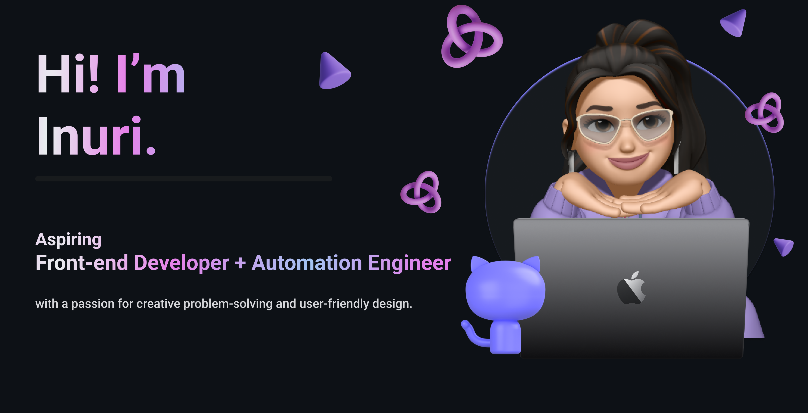

<h1 align="center">Hello I'm Inuri Gunathilaka</h1>

<!--
**InuriGunathilaka22/InuriGunathilaka22** is a ✨ _special_ ✨ repository because its `README.md` (this file) appears on your GitHub profile.
Here are some ideas to get you started: -->

  
  

  

## 👨🏻‍💻 About Me:

- 🙋‍♂️ All about me is at **[My Website](https://soumyajit.vercel.app/)**

- 🔭 I’m currently working on `Something Intresting`.

- 🌱 I’m currently learning `MERN Stack`

- 🚀 Seeking to collaborate on ` innovative projects!`.

- 💡  I love learning and growing in my field

- 😅 I'm up for chatting about anything, except politics! 

- 👨‍💻 Life Hack: Learn new tech :fire: and share what you have learned :tada:

- ⚡ Fun fact: One of my favorite hobbies is getting lost in a good TV series or movie marathon 🎥🍿

## 🛠️ Technologies and Tools I use:

 

 
 

## ❤️ Let's get connected:

    

## 📊 My GitHub Data:

  
  

